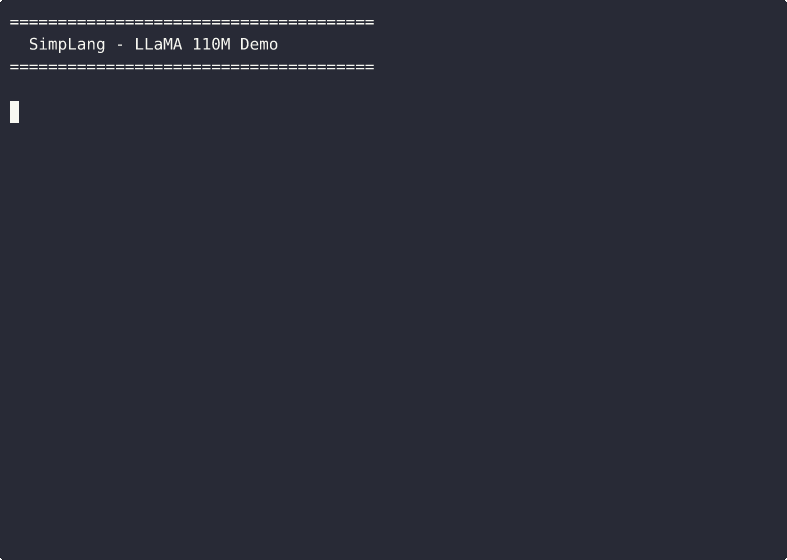

<p align="center">
  
</p>

# SimpLang: A Research Language for Compute and Machine Learning

> **Note**: SimpLang is a research project - one developer's dream to build a complete ML compiler architecture from the ground up. It's a learning journey exploring compiler design, SIMD optimization, and modern ML infrastructure. Expect rough edges, but also expect innovation! 🚀

SimpLang is a domain-specific language (DSL) that bridges high-performance computing and machine learning through **dual compiler backends**:

- **LLVM Backend** - For pure compute applications: automatic SIMD vectorization, scientific computing, signal processing, and numerical algorithms
- **MLIR Backend** ✨ **NEW** - Transforms SimpLang into an ML-focused language: tensor abstractions, layout optimizations (NHWC/NCHW), convolutions, and deep learning operations

Whether you're building a high-performance compute kernel or exploring ML compiler techniques, SimpLang provides a playground for experimentation with real-world performance.

## 🎬 See It In Action

**LLaMA 110M Story Generation** - Running a 110M parameter transformer at **42.95 tokens/s** on CPU:

<p align="center">
  
</p>

*MLIR backend compiling high-level tensor operations (MatMul, RMSNorm, Softmax, SiLU) to optimized CPU code - see `examples/llama2/stories110M.sl`*

## Getting Started

### Quick Start with Docker (Recommended)

The easiest way to get started is using our development helper script:

```bash
# One-time setup (builds container and compiles project)
./dev.sh setup

# Daily development workflow
./dev.sh build           # Rebuild after code changes
./dev.sh test            # Run all tests
./dev.sh debug           # Start interactive debugger
./dev.sh shell           # Open development shell

# Additional commands
./dev.sh clean           # Clean build artifacts
./dev.sh rebuild         # Clean and rebuild everything
```

**Benefits of this approach:**
- ✅ **No rebuilds needed** - Files are live-mounted via Docker volumes
- ✅ **Instant compilation** - Create new `.sl` files and compile immediately
- ✅ **Persistent build cache** - Incremental builds are fast
- ✅ **Easy debugging** - Interactive debugger with live source files

**Legacy Docker commands (still work):**
```bash
# Build and run tests manually
docker build -t simplang . && docker run --rm simplang

# Run individual tests
docker run --rm simplang ./build/tests/test_arithmetic_runner ./build/tests/obj/test_arithmetic.so
```

### Development with VS Code Dev Container

For the best development experience with full IDE support:

1. **Install VS Code extensions:**
   - Dev Containers extension
   - C/C++ extension pack

2. **Open in container:**
   ```bash
   # Clone and open
   git clone <repo-url>
   cd simple-lang
   code .
   # Click "Reopen in Container" when prompted
   ```

3. **Build and test inside container:**
   ```bash
   ./build.sh
   ./run_tests.sh
   ```

### Local Installation (Manual Setup)

If you prefer local development, install these prerequisites:

- LLVM 14 or later
- CMake 3.20+
- C++17 compatible compiler
- Boost libraries
- readline library

```bash
# Ubuntu/Debian
sudo apt update
sudo apt install -y \
    llvm-14-dev \
    clang-14 \
    cmake \
    libboost-dev \
    libreadline-dev
```

### Building SimpLang

You have two options for building:

1. **Using build script (recommended)**
```bash
./build.sh
```

2. **Manual CMake build**
```bash
# Configure with SIMD debugging enabled
cmake -B build -DSIMD_DEBUG=ON

# Build the compiler
cmake --build build --target simplang
```

### Running Tests

Execute the test suite using:
```bash
./run_tests.sh
```

### Using SimpLang

#### LLVM Backend (Default - General Compute)

1. **Compile a SimpLang Kernel**
```bash
# Default LLVM backend
./build/src/simplang my_kernel.sl
```

2. **Run a Compiled Kernel**
```bash
./build/tests/test_loop_runner ./build/tests/obj/test_loop.so
```

#### MLIR Backend (Experimental - ML Workloads)

1. **Compile with MLIR Backend**
```bash
# Enable MLIR backend with --emit-mlir flag
./build/src/simplang my_kernel.sl --emit-mlir -o kernel.o

# Create shared library
gcc -shared -fPIC kernel.o -o kernel.so
```

2. **Run MLIR Kernel**
```bash
# Use custom host runner for MLIR kernels (memref calling convention)
./matmul_host kernel.so
```

3. **Enable Optimizations**
```bash
# Enable loop tiling for better cache locality
./build/src/simplang kernel.sl --emit-mlir --enable-tiling -o kernel.o

# Dump intermediate IR for debugging
./build/src/simplang kernel.sl --emit-mlir --dump-mlir-passes
```

### Example Workflow

1. Create a SimpLang kernel (`test_loop.sl`):
```simplang
fn kernel_main() {
    var sum = 0.0;
    var i = 1.0;
    
    while (i <= 100.0) {
        sum = sum + i;
        i = i + 1.0;
    }
    return sum;
}
```

2. Compile the kernel:
```bash
./build/src/simplang test_loop.sl
```

3. Run the compiled kernel:
```bash
./build/tests/test_loop_runner ./build/tests/obj/test_loop.so
```

### Development Tips

- Enable SIMD debugging for detailed vector operation insights:
```bash
cmake -B build -DSIMD_DEBUG=ON
```

- Use the test runner for quick iteration:
```bash
# Compile and run in one step
./run_tests.sh
```

### Common Issues

1. **Build Failures**
   - Ensure LLVM 14 is installed and in PATH
   - Check that all dependencies are installed
   - Verify CMake version is 3.20 or higher

2. **Runtime Issues**
   - Verify kernel compilation succeeded
   - Check shared library paths
   - Enable SIMD_DEBUG for detailed error messages

## Key Features

### 🎯 **Dual Backend Architecture**
- **LLVM Backend** - Stable backend for general compute workloads
  - Built on LLVM infrastructure with optimization passes
  - Automatic SIMD vectorization (SSE/AVX/AVX-512)
  - 25% faster than scalar code on large datasets (1M+ elements)
- **MLIR Backend** ✨ **NEW** - Experimental ML compiler infrastructure
  - Tensor operations with multi-dimensional support
  - Layout optimizations (NHWC for GPU, NCHW for CPU)
  - MatMul operation: 4.55 GFLOPS (2.59x slower than C++ - work in progress!)
  - Progressive lowering: Simp → MemRef/Linalg → SCF → LLVM
  - Loop tiling and fusion for cache optimization

### 🚀 **Automatic SIMD Vectorization** (LLVM Backend)
- **Auto-vectorization engine** - Automatically converts scalar loops to SIMD operations
- **AVX-512 support** - Leverages 512-bit vector instructions for up to 16x parallel processing
- **Performance scaling** - 25% faster than scalar code on large datasets (1M+ elements)
- **Zero expertise required** - Get SIMD benefits without manual vector programming

### 🏗️ **Compiler Infrastructure**
- **Static type system** - Type checking with error reporting
- **Float-optimized pipeline** - Type system designed for vectorization
- **Optimization passes** - Loop vectorization, SLP vectorization, and memory optimization
- **Multi-dialect lowering** (MLIR) - Progressive transformation through specialized dialects

### 🔧 **SIMD Hardware Abstraction**
- **Plugin-based SIMD backends** - Extensible architecture supporting multiple SIMD instruction sets
- **SSE/AVX/AVX-512 support** - Automatic selection of optimal SIMD instruction set
- **Aligned memory management** - SIMD-optimized memory allocation and access patterns
- **Hardware feature detection** - Runtime detection and utilization of available SIMD capabilities

### 🐛 **Advanced Debugging System**
- **Interactive debugger** - GDB-like command-line interface with source-level debugging
- **Memory tracking** - Automatic leak detection and out-of-bounds access prevention
- **Call stack inspection** - Full function call tracking with local variable analysis
- **SIMD register inspection** - Examine vector register contents and operation flow

### 📊 **Comprehensive Testing & Benchmarking**
- **Performance test suite** - Automated benchmarks comparing against scalar and optimized C++
- **Scaling analysis** - Tests from small (1K) to very large (16M+) array sizes
- **Cross-platform support** - Docker-based development with live file mounting
- **VS Code integration** - Full IDE support with dev container configuration

### 🎯 **Core Features**
- **Host-kernel architecture** - Modular design with C++ host integration
- **Error handling** - Error reporting and recovery mechanisms
- **Logging system** - Configurable logging levels for debugging
- **Memory safety** - Automatic resource management and cleanup

### ⚡ **Performance Characteristics**
- **JIT compilation** - Sub-millisecond compilation overhead
- **Memory efficiency** - ~2MB overhead per kernel instance
- **SIMD breakeven point** - Performance benefits emerge at 16K-32K element arrays
- **Realistic performance** - Achieves 75% of expert-optimized C++ performance automatically

## Core Concepts

### Host-Kernel Architecture

SimpLang employs a Host-Kernel architecture. Your main application (the **host**, typically written in C++) interacts with specialized, compiled SimpLang code (the **kernel**) to perform computationally intensive tasks.

**Key Benefits:**

* **Modularity:** Kernels can be changed or updated without recompiling the entire host application.
* **Specialization:**  Kernels are optimized for specific SIMD tasks.
* **Isolation:** Kernel crashes are contained, preventing host application failure.

### Workflow

1. **Write SimpLang Kernel Code:** Define your SIMD-optimized logic within a SimpLang kernel.
2. **Compile Kernel:** The SimpLang compiler transforms your code into a shared library (e.g., `.so` on Linux).
3. **Integrate with Host Program:**  Your C++ host application loads and executes the compiled kernel.

### Safety and Reliability

SimpLang prioritizes safety and reliability through:

* **Robust Error Handling:**  Provides informative error messages for easier debugging.
* **Automatic Resource Management:** Ensures proper cleanup of memory and other resources.
* **Type Safety:**  Enforces data type consistency between the host and kernel.

## Compiler Pipeline: From Source to Execution

The SimpLang compiler transforms your code through a series of stages:

1. **Lexical Analysis (Text to Tokens):** The source code is broken down into fundamental units called tokens (keywords, identifiers, operators, etc.).

   ```simplang
   fn add(var x, var y) {
       return x + y;
   }
   ```

   **Tokens Example:** `fn`, `add`, `(`, `var`, `x`, `,`, `var`, `y`, `)`, `{`, `return`, `x`, `+`, `y`, `}`,

   This stage identifies syntax errors like misspelled keywords.

2. **Syntactic Analysis (Understanding Structure):** The compiler analyzes the token stream to build an Abstract Syntax Tree (AST), representing the code's structure and relationships between elements.

   **AST Example (Simplified):**

   ```
   Function: add
     Parameters: x, y
     Body:
       Return Statement:
         Binary Operation: +
           Left Operand: x
           Right Operand: y
   ```

   This stage detects logical errors, such as incorrect operator usage.

3. **Optimization:** The compiler applies various optimizations to improve performance:

   * **Basic Optimizations:** Simplifies expressions, removes redundant operations, and reorders calculations.
   * **SIMD Optimization:** Leverages CPU instructions to perform multiple operations in parallel (e.g., using SSE or AVX).
   * **Memory Optimization:**  Arranges data for efficient access, including data alignment and minimizing unnecessary memory transfers.

4. **Code Generation (Final Output):** The optimized code is translated into a shared library (e.g., `.so`). This library includes:

   * **Executable Code:**  Machine code ready for execution.
   * **Debug Information:**  Facilitates debugging by mapping source code to machine code.

**Development Experience:**

* **Clear Error Messages:**  Provides specific and helpful error messages to pinpoint issues.
* **Warnings:**  Alerts developers to potential problems that might not be immediate errors.
* **Debug Information:** Enables source-level debugging.

**Performance Focus:** The compiler is designed to generate highly efficient code by leveraging modern CPU features, SIMD instructions, and cache-friendly memory layouts.

## Debugging Infrastructure

SimpLang provides a robust debugging infrastructure for inspecting kernel behavior with minimal performance impact when disabled.

**Core Architecture:**

```
Host Program <-> Debug Interface <-> Kernel Runtime
     |               |                    |
     +-> Commands ---+-> Runtime Hooks    |
     |               |                    |
     +-- State   <---+-- Event Queue     |
     |               |                    |
     +-- Control <---+-- Breakpoints     |
```

**Key Features:**

* **Hardware and Software Breakpoints:** Supports setting breakpoints using hardware registers (minimal overhead) or software interrupts.
    * **Zero Overhead (Disabled):** Breakpoint checks have negligible performance impact when not active.
    * **Conditional Breakpoints:**  Break execution based on specific conditions.
    * **Source-Level Mapping:**  Relate breakpoints to specific lines of SimpLang code.
* **Memory Tracking:**  Monitors memory allocation and usage to detect leaks and analyze patterns.
    * **SIMD Alignment Verification:** Ensures data is correctly aligned for SIMD operations.
    * **Vector Operation Tracking:** Monitors memory access during vector operations.
    * **Memory Access Pattern Analysis:** Helps identify inefficient memory access.
* **Call Stack Inspection:** Provides detailed call stack information, including function arguments and local variable states.
    * **SIMD Register Inspection:** Examine the contents of SIMD registers.
    * **Vector Operation Flow:** Track the execution of vector operations.
    * **Memory Access Analysis:**  Analyze memory access patterns within the call stack.
* **Asynchronous Event Processing:**  Handles debugging events efficiently without blocking kernel execution.
    * **Lock-Free Queue:**  Utilizes lock-free data structures for high-throughput event processing.
    * **Configurable Buffering:**  Allows customization of event buffering strategies.
    * **Real-time Filtering:**  Filter specific debugging events.

**Integration Example (C++ Host):**

```cpp
// Attach debugger with custom configuration
DebugConfig config;
config.enableMemoryTracking()
     .setBreakpointMode(HardwareBreakpoints)
     .setEventBuffering(1024);

runner.attachDebugger(config);

// Register custom event handlers
runner.debugger().onMemoryLeak([](const LeakInfo& info) {
    std::cout << "Leak detected: " << info.size << " bytes\n";
});
```

**Performance Characteristics (Approximate):**

* **Breakpoints (inactive):** Near zero overhead.
* **Memory Tracking:** 2-5% overhead.
* **Call Stack Inspection:** 1-3% overhead.
* **Event System:** <1% overhead with buffering.

## Core Language Features

### SIMD Operations

SimpLang offers native support for SIMD operations, abstracting the underlying hardware details:

* **SSE Support:**  Provides 128-bit vector operations with aligned memory access and optimized math functions.
* **AVX Support:**  Offers 256-bit vector operations with advanced vector extensions and hardware-specific optimizations.

### Runtime System

The SimpLang runtime environment provides essential services for kernel execution:

* **Memory Management:**
    * **SIMD-Aligned Allocations:** Ensures memory is aligned for optimal SIMD performance.
    * **Memory Pool Optimization:**  Improves allocation efficiency for frequently used memory blocks.
    * **Optional Garbage Collection:**  Can automatically manage memory, reducing manual memory management.
* **Error Handling:**  Manages exceptions and provides mechanisms for error recovery and debugging information.
* **Performance Monitoring:** Tracks operation timing, memory usage, and provides hints for potential optimizations.

## Implementation Example

### SimpLang Kernel (`kernel.sl`)

```simplang
fn bounded_sum(var n) {
    var sum = 0.0;
    var i = 1.0;

    while (i <= n) {
        sum = (sum + i) % 10000.0;
        i = i + 1.0;
    }
    return sum;
}

fn kernel_main() {
    var n = 100000.0;
    return bounded_sum(n);
}
```

### Host Program Integration (C++)

```cpp
#include "kernel_runner.hpp"
#include <iostream>

int main() {
    try {
        KernelRunner runner;
        runner.loadLibrary("./kernel.so"); // Assuming kernel.so is the compiled output

        // Optional: Enable debugging
        // runner.attachDebugger();

        // Run kernel and get result
        double result = runner.runKernel();

        std::cout << "Result: " << result << std::endl;
        return 0;
    } catch (const std::exception& e) {
        std::cerr << "Error: " << e.what() << std::endl;
        return 1;
    }
}
```

## Performance Characteristics (Typical)

* **JIT Compilation Overhead:** < 1 millisecond.
* **SIMD Operation Performance:** Approximately 1.3x slower than highly optimized native C++ (trade-off for abstraction and ease of use).
* **Memory Overhead:**  Around 2MB per kernel instance.
* **Debug Mode Overhead:**  Approximately 5% in typical usage scenarios.

## Development Workflow

1. **Write SimpLang Kernel Code:** Create your SIMD-optimized logic in `.sl` files.
2. **Compile Kernel:** Use the SimpLang compiler to generate a shared library (e.g., `kernel.so`).
3. **Integrate with Host Program:** Load and interact with the compiled kernel from your C++ application using the provided `KernelRunner` API.
4. **Debug:** Utilize the built-in debugging infrastructure to step through code, inspect variables, and analyze performance.
5. **Profile and Optimize:**  Identify performance bottlenecks and refine your SimpLang code or compiler settings.

## MLIR Backend Roadmap

The MLIR backend is actively being developed with the following planned features:

### 🔄 **Current Work** (Session 11 - In Planning)
* **Tensor Abstractions** - 4D tensor support with NHWC layout
* **Conv2D Operation** - 2D convolution with affine map layouts
* **Multi-dimensional Indexing** - Support for `tensor[n, h, w, c]` syntax
* **Layout Optimizations** - NHWC (GPU-optimized) and NCHW (CPU-optimized) layouts

### 📋 **Upcoming** (Sessions 12-14)
* **Native Tensor Dialect** - Use MLIR's tensor operations instead of memref workarounds
* **Bufferization** - Automatic tensor-to-memref conversion with layout preservation
* **Tensor Fusion** - Fuse operations to reduce memory traffic
* **Custom Lowering** - Fix matmul accumulator pattern (eliminate 256x memory stores!)

### 🚀 **Future Enhancements** (Sessions 15+)
* **Performance Optimization** - Match C++ baseline performance
* **More Operations** - Pooling, activations (ReLU, sigmoid), reductions
* **GPU Support** - Lower to GPU dialect for CUDA/ROCm
* **Dynamic Shapes** - Runtime-determined tensor dimensions

📖 **Full Roadmap**: See `docs/TENSOR_IMPLEMENTATION_GUIDE.md` and `MLIR_FUTURE_ROADMAP.md`

## Future Directions

* **Language Extensions:**
    * Template support for generic programming
    * Meta-programming capabilities for compile-time code generation
    * Advanced control flow constructs for complex algorithms
* **Optimization Improvements:**
    * ✅ **Auto-vectorization** - ✨ **COMPLETED** - Automatic SIMD code generation from scalar operations
    * ✅ **MLIR Backend** - ✨ **IN PROGRESS** - Tensor operations for ML workloads
    * Pattern-based optimizations to recognize and optimize common code patterns
    * Hardware-specific tuning to leverage unique features of different processor architectures
    * Memory prefetching optimizations for improved cache utilization
* **SIMD Enhancements:**
    * GPU compute backend integration (CUDA/OpenCL via MLIR GPU dialect)
    * ARM NEON SIMD support for mobile and embedded platforms
    * Custom SIMD instruction pattern matching and generation
* **Tooling:**
    * ✅ **VS Code integration** - ✨ **COMPLETED** - Dev container with full IDE support
    * Visual debugger for a more intuitive debugging experience
    * Performance analyzer to provide detailed performance insights
    * Real-time performance profiling and optimization suggestions

## Contributing

For information on how to contribute to SimpLang development, please refer to the `CONTRIBUTING.md` file. This includes guidelines for:

* **Code Style:**  Ensuring consistent and readable code.
* **Testing Requirements:**  Writing thorough unit and integration tests.
* **Pull Request Process:**  Submitting changes effectively.
* **Documentation Standards:**  Maintaining clear and up-to-date documentation.
