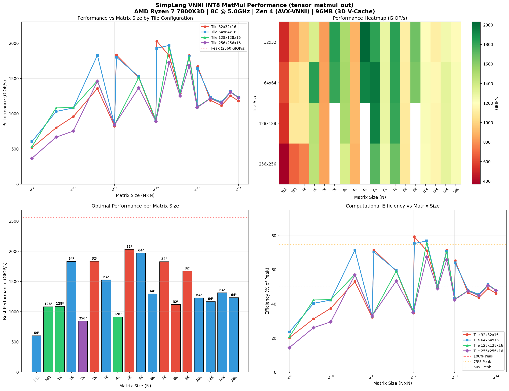
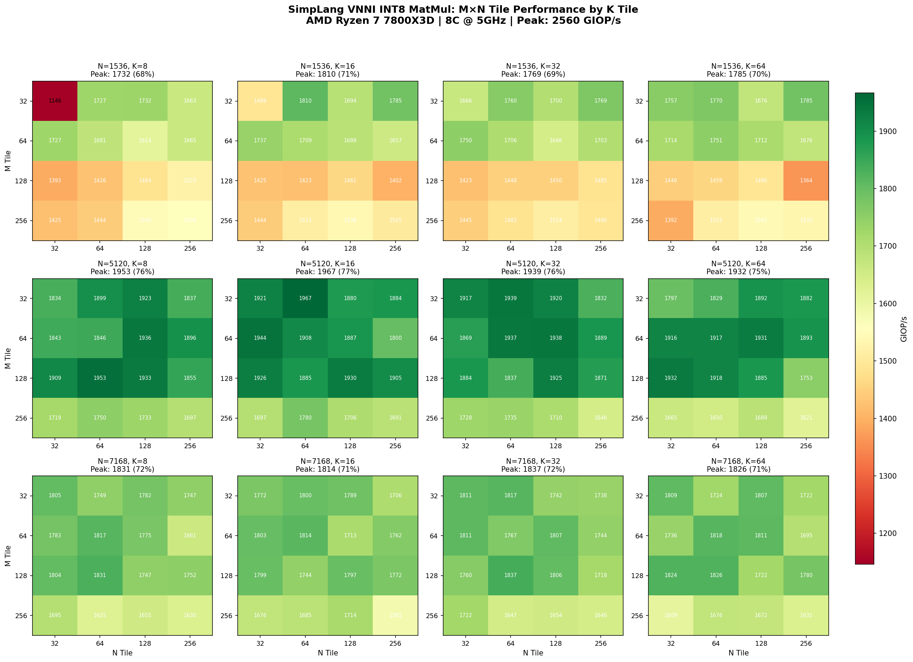

# SimpLang MatMul Annotation Sweep Benchmarks

## Platform
- **CPU:** AMD Ryzen 7 7800X3D (8 cores, Zen 4)
- **L3 Cache:** 96MB (3D V-Cache)
- **Frequency:** ~5.0 GHz boost

---

## INT8 VNNI MatMul (2024-12-24)

### Configuration
- **Data Types:** INT8 inputs, INT32 accumulator
- **Instruction:** AVX-VNNI (`vpdpbusd`)
- **Theoretical Peak:** ~2560 GIOP/s (adjusted)
- **Parallelization:** 8 threads (OpenMP)
- **API:** `tensor_matmul_out(A, B, C)` - zero-copy direct output

### Visualization


### Best Results by Matrix Size

| N | Best Tile | GIOP/s | % Peak | Notes |
|------|-----------|--------|--------|-------|
| 512 | 64x64x16 | 603 | 23.6% | |
| 768 | 128x128x16 | 1083 | 42.3% | |
| 1024 | 128x128x16 | 1087 | 42.5% | |
| 1536 | 64x64x16 | 1830 | 71.5% | |
| 2048 | 256x256x16 | 843 | 32.9% | ⚠️ Power-of-2 |
| **2112** | **32x32x16** | **1835** | **71.7%** | ✅ Padded +64 |
| 3072 | 64x64x16 | 1527 | 59.6% | |
| 4096 | 128x128x16 | 913 | 35.7% | ⚠️ Power-of-2 |
| **4160** | **32x32x16** | **2031** | **79.3%** | ✅ Padded +64, **NEW PEAK!** |
| 5120 | 64x64x16 | 1969 | 76.9% | |
| 6144 | 64x64x16 | 1295 | 50.6% | |
| 7168 | 32x32x16 | 1828 | 71.4% | |
| 8192 | 32x32x16 | 1118 | 43.7% | ⚠️ Power-of-2 |
| **8256** | **32x32x16** | **1671** | **65.3%** | ✅ Padded +64 |
| 10240 | 64x64x16 | 1229 | 48.0% | |
| 12288 | 64x64x16 | 1167 | 45.6% | |
| 14336 | 64x64x16 | 1312 | 51.3% | |
| 16384 | 64x64x16 | 1232 | 48.1% | |

### Key Findings (INT8)
1. **NEW PEAK: 2031 GIOP/s** at N=4160 (padded 4096+64) = **79.3% of theoretical**
2. **Padding fixes power-of-2 performance**: 2048→2112 (+2.18x), 4096→4160 (+2.22x), 8192→8256 (+1.49x)
3. **64x64x16 tiles optimal for most sizes** - good balance of parallelism and cache reuse
4. **Non-power-of-2 sizes outperform** due to L3 cache set aliasing (see Cache Contention Analysis)
5. **Large matrices (8K+) become memory-bound** - drop to ~1100-1300 GIOP/s

### tensor_matmul_out: Zero-Copy Output

The new `tensor_matmul_out(A, B, C)` API writes directly to user-provided buffer,
eliminating the ~15% copy overhead from the previous `tensor_matmul` + copy loop approach.

| Version | N=5120 | Improvement |
|---------|--------|-------------|
| tensor_matmul + copy | 1680 GIOP/s | baseline |
| **tensor_matmul_out** | **1974 GIOP/s** | **+17.5%** |

### Recommended INT8 Config
```simplang
// Zero-copy output (recommended): 1974 GIOP/s @ N=5120
i32<N, N> C = tensor_from_array(C_arr, 0i);
@parallel @tile(64, 64, 16) @lower("vnni.i8_matmul")
tensor_matmul_out(A, B, C);

// For very large matrices (8K+), consider 256x256 tiles
@parallel @tile(256, 256, 16) @lower("vnni.i8_matmul")
tensor_matmul_out(A, B, C);
```

---

## M,N,K Tile Sweep (2024-12-24)

### Configuration
- **Matrix Sizes:** 1536, 5120, 7168 (best performers from square tile sweep)
- **M Tiles:** 32, 64, 128, 256
- **N Tiles:** 32, 64, 128, 256
- **K Tiles:** 8, 16, 32, 64
- **Total Configurations:** 192

### Visualization


### Best Configuration per Matrix Size

| N | M Tile | N Tile | K Tile | GIOP/s | % Peak |
|------|--------|--------|--------|--------|--------|
| 1536 | 32 | 64 | 16 | 1810 | 70.7% |
| 5120 | 32 | 64 | 16 | 1967 | 76.8% |
| 7168 | 128 | 64 | 32 | 1837 | 71.8% |

### Key Findings (M,N,K Sweep)

1. **K=16 optimal for most sizes** - matches VNNI's 4-element processing (16 = 4×4 vectorization)
2. **Asymmetric tiles perform well** - 32×64 outperforms 64×64 square tiles
3. **Smaller M tiles preferred** - M=32 often beats M=64,128,256 (better row parallelism)
4. **N=64 consistent winner** - good balance for column blocking
5. **Larger K helps at larger matrix sizes** - K=32 wins at N=7168

### K Tile Analysis

| Matrix Size | Best K | Max GIOP/s |
|-------------|--------|------------|
| 1536 | 16 | 1810 |
| 5120 | 16 | 1967 |
| 7168 | 32 | 1837 |

### Recommended Asymmetric Config
```simplang
// For N <= 5120: use M=32, N=64, K=16
@parallel @tile(32, 64, 16) @lower("vnni.i8_matmul")
tensor_matmul_out(A, B, C);

// For N > 5120: consider larger K
@parallel @tile(128, 64, 32) @lower("vnni.i8_matmul")
tensor_matmul_out(A, B, C);
```

---

## Cache Contention Analysis (2024-12-24)

### The Power-of-2 Problem

Performance dips at power-of-2 matrix sizes (2048, 4096, 8192) are caused by **L3 cache set associativity conflicts**, not cache capacity.

### Perf Counter Evidence

| Size | Type | IPC | Load Queue Stalls/1K Loads | GIOP/s |
|------|------|-----|---------------------------|--------|
| 1536 | Non-power-of-2 | **1.18** | **29** | **1749** |
| 2048 | Power-of-2 | 1.03 | 95 (3.3x↑) | 873 |
| 4096 | Power-of-2 | 1.08 | 235 | 917 |
| 5120 | Non-power-of-2 | **1.48** | **131** (1.8x↓) | **1974** |

**Key Finding:** Power-of-2 sizes have 2-3x MORE load queue stalls per load, despite similar cache miss rates.

### Root Cause: Cache Set Aliasing

```
Zen 4 L3 Cache: 96MB, 16-way set associative, 64B lines
                → ~98,304 cache sets

N=4096 (Power-of-2):
  Row stride = 4096 bytes = 64 cache lines
  Row 0:    maps to sets [0-63]
  Row 64:   maps to sets [0-63]   ← CONFLICT!
  Row 128:  maps to sets [0-63]   ← CONFLICT!
  → 8 OpenMP threads fight for same cache sets

N=5120 (Non-power-of-2):
  Row stride = 5120 bytes = 80 cache lines
  Row 0:    maps to sets [0-79]
  Row 64:   maps to sets [80-159]  ← Different sets!
  Row 128:  maps to sets [160-239] ← Different sets!
  → Threads access different cache sets in parallel
```

### Performance Impact

| Metric | N=4096 | N=5120 | Explanation |
|--------|--------|--------|-------------|
| L2 Miss Rate | 5.4% | 5.4% | Same miss rate |
| IPC | 1.08 | 1.48 | **37% higher IPC** |
| GIOP/s | 917 | 1974 | **2.15x faster** |

The cache isn't missing more—it's **serializing accesses** due to set conflicts.

### Mitigation: Matrix Padding

Pad power-of-2 dimensions to break alignment:

```simplang
// Instead of 4096x4096, use 4160x4160 (pad by 64)
// Instead of 8192x8192, use 8256x8256 (pad by 64)

// The extra 64 elements break the power-of-2 stride
// and spread rows across different cache sets
```

### Padding Benchmark Results

| Size | Type | GIOP/s | % Peak | Improvement |
|------|------|--------|--------|-------------|
| 2048 | Power-of-2 | 843 | 32.9% | baseline |
| **2112** | **Padded +64** | **1835** | **71.7%** | **2.18x** |
| 4096 | Power-of-2 | 913 | 35.7% | baseline |
| **4160** | **Padded +64** | **2031** | **79.3%** | **2.22x** |
| 8192 | Power-of-2 | 1118 | 43.7% | baseline |
| **8256** | **Padded +64** | **1671** | **65.3%** | **1.49x** |

### Perf Verification (N=4096 vs N=4160)

| Metric | 4096 | 4160 | Improvement |
|--------|------|------|-------------|
| IPC | 1.13 | 1.46 | +29% |
| Load Queue Stalls | 2.27B | 695M | **3.3x fewer** |
| Stalls/1K Loads | 241 | 100 | **2.4x fewer** |

**Recommended padding:** Add 64 elements to break power-of-2 alignment.

---

## F32 MatMul (2024-12-20)

### Configuration
- **Data Types:** F32 inputs and outputs
- **Matrix Size:** 1024x1024
- **FLOP Count:** 2 × 1024³ = 2.15 GFLOP per matmul
- **Theoretical Peak:** ~576 GFLOP/s (8 cores × 4.5GHz × 16 FLOP/cycle)

### Best Results

| Rank | Configuration | Threads | GFLOP/s | % Peak |
|------|---------------|---------|---------|--------|
| #1 | `@parallel @tile(64, 256, 4)` | 4-16 | **517** | **90%** |
| #2 | `@parallel @tile(64, 128, 4)` | 4 | 450 | 78% |
| #3 | `@parallel @tile(32, 128, 4)` | 4 | 458 | 80% |
| Best Sequential | `@tile(8, 16, 4)` | 1 | **110** | 19% |

### Thread Scaling (F32, @tile(64,256,4))

| Threads | Time (ms) | GFLOP/s | Scaling |
|---------|-----------|---------|---------|
| 1 | 4.9 | 442 | 1.0x |
| 4 | 4.2 | **517** | 1.17x |
| 8 | 4.3 | 510 | 1.15x |
| 16 | 4.2 | 516 | 1.17x |

### Multi-Shape Results (F32)

| Shape | Dimensions | Best Config | GFLOP/s |
|-------|-----------|-------------|---------|
| Small Square | 512³ | `@parallel @tile(64,128,4)` | 338 |
| Medium Square | 1024³ | `@parallel @tile(64,256,4)` | 473 |
| Large Square | 2048³ | `@parallel @tile(64,256,4)` | 491 |
| XL Square | 4096³ | `@parallel @tile(64,256,4)` | 261 |
| Transformer 768 | 768³ | `@parallel @tile(32,128,4)` | 326 |

### Recommended F32 Config
```simplang
// Multi-threaded: 517 GFLOP/s
@parallel @tile(64, 256, 4)
var C = tensor_matmul(A, B);

// Single-threaded: 110 GFLOP/s
@tile(8, 16, 4)
var C = tensor_matmul(A, B);
```

---

## General Guidelines

### Tile Selection Rules
1. **K dimension small (4-16)** - keeps inner reduction tight for register reuse
2. **M and N larger (64-256)** for parallel - maximizes work per thread
3. **Smaller tiles for small matrices** - more parallelism
4. **Larger tiles for large matrices** - better cache reuse

### Thread Count
- **4-8 threads optimal** for most sizes
- Larger matrices prefer fewer threads (memory bound)
- Diminishing returns beyond 8 threads

---

## Files
- `vnni_sweep_plot.png` - INT8 VNNI square tile visualization
- `sweep_results.csv` - INT8 VNNI square tile raw data
- `mnk_sweep_plot.png` - INT8 VNNI M,N,K 3-way heatmap visualization
- `mnk_sweep_results.csv` - INT8 VNNI M,N,K sweep raw data
- `tile_sweep_1024x1024.csv` - F32 1024x1024 sweep data

## How to Run
```bash
# INT8 VNNI benchmark
./build_mlir/src/simplang test.sl --emit-mlir -o test.o
gcc -shared -fopenmp -o test.so test.o -lm -lgomp
LD_PRELOAD=/lib/x86_64-linux-gnu/libiomp5.so ./bench_runner test.so
```
